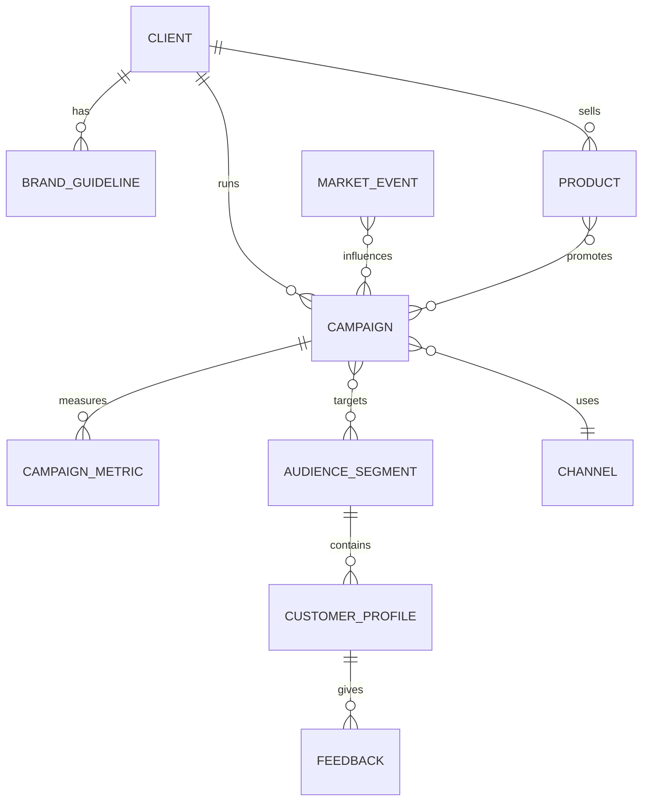
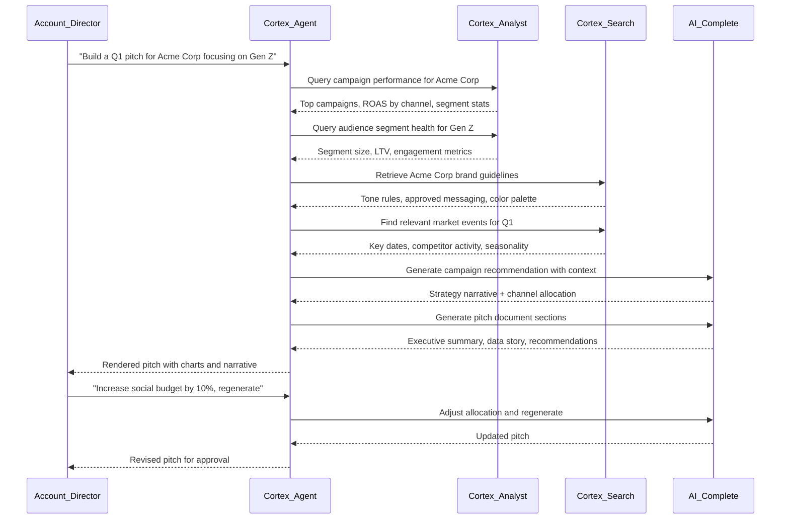
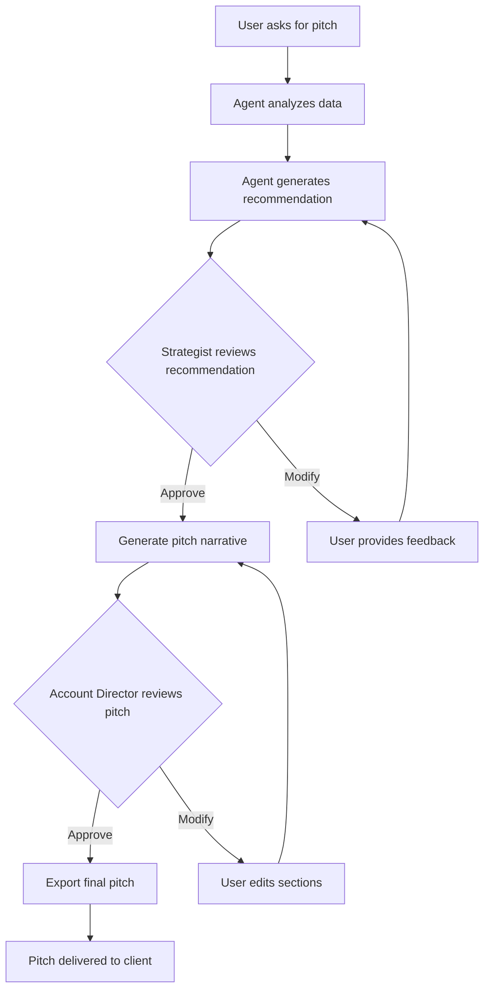

# Snowflake Marketing Co-Pilot and Pitch Engine - Architecture Plan

## Context

**Project:** Snowflake CoCo CLI Hackathon (GCC Edition) **Account:** WFVAMNP-AP54607 (not yet provisioned for use) **Workspace:** `c:\Users\majithkumar\SnowflakeHackathon` (currently empty)

**Key decisions from requirements gathering:**

- Full-service agency supporting 10+ client brands
- Visually rich, data-driven pitch output (charts, KPIs, recommendations)
- Fully synthetic data generated for the hackathon demo

---

## 1. Business Problem and Objectives

**Problem:** Marketing agencies waste significant time manually assembling campaign performance data, audience insights, and competitive intelligence to produce client pitch decks. Each pitch requires analysts to query multiple data sources, strategists to interpret trends, and creatives to package the narrative -- a process that can take days.

**Objectives:**

- Reduce pitch preparation time from days to minutes
- Deliver data-backed campaign recommendations grounded in historical performance
- Ensure brand-safe messaging by incorporating brand guidelines into generation
- Enable multi-client scalability without proportional headcount growth
- Provide an auditable, explainable recommendation trail

---

## 2. Target Users

| Persona             | Role                      | Primary Need                               |
| ------------------- | ------------------------- | ------------------------------------------ |
| Account Director    | Client relationship owner | Quick, polished pitch with defensible data |
| Media Strategist    | Channel planning          | Next-best channel and budget allocation    |
| Data Analyst        | Performance reporting     | Self-service campaign analytics            |
| Creative Strategist | Messaging and positioning | Brand-aligned creative direction           |
| Client (viewer)     | Receives pitch            | Clear, visual, compelling narrative        |

---

## 3. Key Business Questions

The system must answer:

1. "Which campaigns drove the highest ROI for this client in the last 6 months?"
2. "What audience segments are underperforming, and what should we do differently?"
3. "Given seasonality and market events, what is the optimal campaign timing?"
4. "What creative messaging resonates most with segment X?"
5. "How should we allocate budget across channels for maximum reach and conversion?"
6. "What are competitor trends we should react to?"
7. "Generate a pitch for Client Y focusing on Q1 product launch"

---

## 4. Required Data Entities and Relationships



---

## 5. Proposed Data Model

### Structured Tables (Cortex Analyst)

| Table                     | Key Columns                                                                                   | Grain                                                     |
| ------------------------- | --------------------------------------------------------------------------------------------- | --------------------------------------------------------- |
| `DIM_CLIENT`              | client\_id, name, industry, region, contract\_start                                           | One row per client                                        |
| `DIM_PRODUCT`             | product\_id, client\_id, name, category, launch\_date, price\_tier                            | One row per product                                       |
| `DIM_AUDIENCE_SEGMENT`    | segment\_id, client\_id, name, demographics\_json, size\_estimate                             | One row per segment                                       |
| `DIM_CHANNEL`             | channel\_id, name, type (digital/traditional/social)                                          | One row per channel                                       |
| `DIM_CUSTOMER_PROFILE`    | customer\_id, segment\_id, age\_band, geo, lifetime\_value                                    | One row per customer                                      |
| `FACT_CAMPAIGN`           | campaign\_id, client\_id, product\_id, channel\_id, start\_date, end\_date, budget, objective | One row per campaign                                      |
| `FACT_CAMPAIGN_METRICS`   | metric\_id, campaign\_id, date, impressions, clicks, conversions, spend, revenue, ctr, roas   | Daily grain per campaign                                  |
| `FACT_CUSTOMER_FEEDBACK`  | feedback\_id, customer\_id, campaign\_id, date, sentiment\_score, text, rating                | One row per feedback item                                 |
| `DIM_MARKET_EVENT`        | event\_id, event\_type, region, start\_date, end\_date, description                           | External events (holidays, competitor launches, economic) |
| `BRIDGE_CAMPAIGN_SEGMENT` | campaign\_id, segment\_id, allocation\_pct                                                    | Many-to-many                                              |

### Unstructured / Semi-structured (Cortex Search)

| Document Type      | Storage                | Purpose                                 |
| ------------------ | ---------------------- | --------------------------------------- |
| Brand Guidelines   | Internal stage, PDF/MD | Tone, colors, do/don't rules per client |
| Creative Briefs    | Internal stage, MD     | Past pitch narratives                   |
| Competitor Reports | Internal stage, PDF    | Market intelligence                     |

---

## 6. Marketing Ontology

The semantic layer maps business language to physical columns:

```yaml
# Core marketing concepts -> table mappings
ontology:
  campaign_performance:
    entity: FACT_CAMPAIGN_METRICS
    metrics:
      - roas: revenue / spend
      - ctr: clicks / impressions
      - cpc: spend / clicks
      - conversion_rate: conversions / clicks
    dimensions:
      - channel (via FACT_CAMPAIGN -> DIM_CHANNEL)
      - segment (via BRIDGE_CAMPAIGN_SEGMENT -> DIM_AUDIENCE_SEGMENT)
      - product (via FACT_CAMPAIGN -> DIM_PRODUCT)
      - time (date, week, month, quarter)

  audience_health:
    entity: DIM_AUDIENCE_SEGMENT + DIM_CUSTOMER_PROFILE
    metrics:
      - avg_lifetime_value
      - segment_size
      - engagement_rate
    dimensions:
      - demographics (age_band, geo)
      - segment_name

  brand_sentiment:
    entity: FACT_CUSTOMER_FEEDBACK
    metrics:
      - avg_sentiment_score
      - nps (derived from rating)
      - feedback_volume
    dimensions:
      - campaign, product, segment, time
```

---

## 7. Agentic Workflow



### Agent Tool Definitions

| Tool                           | Purpose                                | Backend                         |
| ------------------------------ | -------------------------------------- | ------------------------------- |
| `analyze_campaign_performance` | Query structured campaign metrics      | Cortex Analyst (semantic model) |
| `analyze_audience_segments`    | Query segment health and demographics  | Cortex Analyst                  |
| `search_brand_guidelines`      | Retrieve brand rules for a client      | Cortex Search                   |
| `search_market_intelligence`   | Find market events and competitor data | Cortex Search                   |
| `generate_recommendation`      | Produce strategy narrative             | AI\_COMPLETE (llama or mistral) |
| `generate_pitch_section`       | Write a specific pitch section         | AI\_COMPLETE                    |
| `calculate_budget_allocation`  | Optimize channel budget split          | Stored procedure / UDF          |

---

## 8. Recommended CoCo Skills

| Skill                                    | Usage                                                 |
| ---------------------------------------- | ----------------------------------------------------- |
| `agent-studio`                           | Build and validate the Cortex Agent + semantic model  |
| `sql-author`                             | Write and validate DDL and analytical queries         |
| `cortex-ai-function-studio`              | Author AI\_COMPLETE, AI\_SENTIMENT, AI\_EXTRACT calls |
| `developing-with-streamlit-in-snowflake` | Build the pitch dashboard UI                          |
| `search-optimization`                    | Configure Cortex Search services                      |
| `data-quality`                           | Validate synthetic data with DMFs                     |
| `snowpark-python`                        | Data generation scripts and UDFs                      |
| `dynamic-tables`                         | Materialized aggregations for dashboard performance   |

---

## 9. Snowflake Components Required

| Component                         | Purpose                                                                         |
| --------------------------------- | ------------------------------------------------------------------------------- |
| **Database + Schemas**            | `MARKETING_COPILOT_DB` with `RAW`, `ANALYTICS`, `SEMANTIC`, `DOCUMENTS` schemas |
| **Internal Stages**               | `@documents_stage` for brand guidelines and reports                             |
| **Cortex Search Service**         | Over brand guidelines and customer feedback text                                |
| **Cortex Analyst Semantic Model** | YAML defining campaign performance metrics                                      |
| **Cortex Agent**                  | Orchestrator with tool bindings to Analyst + Search                             |
| **Dynamic Tables**                | Pre-aggregated campaign summary, segment health                                 |
| **Streamlit App**                 | Pitch dashboard with st.chat\_input for conversational UX                       |
| **UDFs/Stored Procedures**        | Budget optimizer, pitch formatter                                               |
| **Tasks**                         | Scheduled refresh of dynamic tables                                             |
| **Warehouse**                     | XS for queries, S for data generation                                           |

---

## 10. Cortex Search / Cortex Analyst Usage

### Cortex Analyst

- **Semantic Model YAML** defines all structured metrics (ROAS, CTR, conversion rate, budget utilization)

- **Verified Queries (VQRs)** for common questions:

  - "Top 5 campaigns by ROAS for client X"
  - "Month-over-month spend trend by channel"
  - "Segment performance comparison"

- The Agent calls Cortex Analyst as a tool; user questions in natural language get translated to SQL

### Cortex Search

- **Service 1: Brand Intelligence** -- indexes brand guidelines (PDF/MD per client), returns relevant tone/rules when generating pitch content
- **Service 2: Feedback Corpus** -- indexes customer feedback text for sentiment themes and verbatim quotes to include in pitches
- **Service 3: Market Events** -- indexes competitor reports and market event descriptions for context

---

## 11. Potential MCP Integration

MCP (Model Context Protocol) servers could extend the agent's capabilities:

| MCP Server                         | Purpose                                        |
| ---------------------------------- | ---------------------------------------------- |
| Google Slides / PowerPoint         | Export pitch to actual slide deck              |
| Google Analytics connector         | Pull real-time web analytics (future)          |
| CRM connector (HubSpot/Salesforce) | Pull live client pipeline data                 |
| Slack notification                 | Post pitch drafts to client channel for review |

For the hackathon MVP, MCP is optional. The pitch output will be rendered in Streamlit with export-to-PDF capability.

---

## 12. Human-in-the-Loop Approval Points



**Approval gates:**

1. **Data validation** -- User confirms the data summary is correct before recommendation
2. **Strategy approval** -- User approves or adjusts channel/budget recommendation
3. **Narrative review** -- User reviews generated pitch text before finalization
4. **Final sign-off** -- Account Director approves before client delivery

---

## 13. Testing and Validation Strategy

| Layer            | What to Test                                                                 | Method                     |
| ---------------- | ---------------------------------------------------------------------------- | -------------------------- |
| Data quality     | Synthetic data passes business rules (positive spend, valid dates, ROAS > 0) | DMFs + SQL assertions      |
| Semantic model   | Verified queries return expected results                                     | Cortex Analyst VQR testing |
| Search relevance | Brand guideline retrieval for known queries                                  | Manual relevance scoring   |
| Agent behavior   | End-to-end pitch generation for 3 sample clients                             | Scripted test prompts      |
| UI rendering     | Charts render correctly, export works                                        | Manual Streamlit testing   |
| Edge cases       | Client with no campaigns, empty segments, missing guidelines                 | Synthetic edge-case data   |

---

## 14. MVP Scope vs Future Enhancements

### MVP (Hackathon Deliverable)

- 10 synthetic client brands with 2 years of campaign data

- Cortex Analyst semantic model for campaign metrics

- Cortex Search over brand guidelines

- Cortex Agent orchestrating analysis + pitch generation

- Streamlit dashboard showing:

  - Conversational interface (ask questions about any client)
  - Campaign performance charts (auto-generated)
  - Recommendation card with strategy rationale
  - Generated pitch narrative with key metrics highlighted

- Human-in-the-loop: iterative refinement via chat

### Future Enhancements

- Real data connectors (Google Ads, Meta Ads, CRM)
- MCP integration for slide deck export
- Multi-language pitch generation
- A/B test recommendation engine
- Predictive ROAS modeling (Cortex ML)
- Competitive intelligence via Marketplace data
- Budget optimization via mathematical programming (Snowpark)
- Client portal with branded login
- Approval workflow with email notifications

---

## Implementation Steps

### Step 1: Project Scaffold

Create folder structure:

```
SnowflakeHackathon/
  docs/                     # Planning docs
  data/
    generators/             # Python scripts for synthetic data
    samples/                # Sample CSVs for validation
  sql/
    ddl/                    # CREATE TABLE statements
    dml/                    # COPY INTO, INSERT scripts
    dynamic_tables/         # DT definitions
  semantic_models/          # Cortex Analyst YAML
  search/                   # Cortex Search service config
  agents/                   # Agent definition YAML
  streamlit/                # Streamlit app code
  tests/                    # Validation scripts
```

### Step 2: Synthetic Data Generation

Python scripts using Faker + numpy to generate:

- 12 clients across industries (retail, tech, healthcare, finance, CPG, auto, travel, telecom, food, fashion, media, energy)
- 50+ campaigns per client with realistic metrics
- 5-8 audience segments per client
- 10,000+ customer profiles
- 25,000+ feedback records
- 50+ market events
- Brand guideline documents (markdown) per client

### Step 3: Snowflake Schema and Data Load

- DDL for all dimension and fact tables
- Internal stage creation
- COPY INTO commands
- Dynamic tables for pre-aggregated views

### Step 4: Semantic Model for Cortex Analyst

- YAML file defining entities, metrics, dimensions, relationships
- 10+ verified queries covering common analytical questions
- Validation via Cortex Analyst testing

### Step 5: Cortex Search Service

- Service over brand guidelines (chunked by section)
- Service over customer feedback text
- Relevance testing with sample queries

### Step 6: Cortex Agent

- Agent definition with tool bindings
- System prompt encoding the marketing strategist persona
- Tool definitions pointing to Analyst + Search + AI\_COMPLETE
- Iterative testing with diverse prompts

### Step 7: Streamlit Dashboard

- Chat interface using st.chat\_input / st.chat\_message
- Auto-generated Plotly charts for campaign metrics
- KPI cards for key metrics
- Pitch narrative display with sections
- Export button (PDF or formatted markdown)

### Step 8: Demo Preparation

- 3 scripted demo scenarios
- End-to-end validation
- Performance tuning
- Presentation slides

---

## Critical Files

- `docs/marketing_copilot_planning.md` -- This planning document (to be created)
- `semantic_models/campaign_analytics.yaml` -- Core semantic model for Cortex Analyst
- `agents/marketing_copilot_agent.yaml` -- Agent definition with tools
- `streamlit/app.py` -- Main Streamlit pitch dashboard
- `data/generators/generate_all.py` -- Synthetic data generation script

---

## Verification

1. **Data generation**: Run generator, verify row counts and value distributions
2. **Schema**: Execute DDL, confirm tables exist with correct column types
3. **Semantic model**: Run `reflect_semantic_model` to validate YAML
4. **Search**: Query each search service with known-answer questions
5. **Agent**: Submit 5 test prompts covering different scenarios
6. **Dashboard**: Manual walkthrough of all UI flows
7. **End-to-end**: Full pitch generation for 3 different clients
