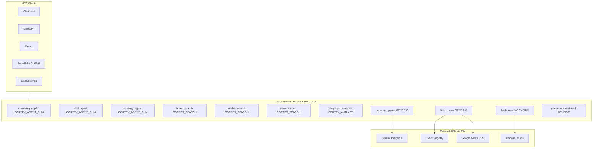

# MCP Integration Plan for NovaSpark Marketing Co-Pilot

## Context

### Current State
The project has 5 categories of external connections, each using a different method:

| Source | Current Method | Problem |
|--------|---------------|---------|
| Google Trends | `pytrends` library (local Python) | Not callable from SiS or agents |
| Event Registry | `eventregistry` SDK (local Python) | API key hardcoded in config.py |
| Google News RSS | `requests.get()` (local Python) | Not callable from SiS |
| Gemini Imagen 3 | `requests.post()` (embedded in Streamlit) | `requests` not available in SiS warehouse runtime |
| Cortex Agents/Search | `DATA_AGENT_RUN` SQL (Streamlit) | Works but not externally accessible |

### MCP Architecture

Snowflake supports two MCP server types relevant here:

1. **Snowflake-managed MCP server** (`CREATE MCP SERVER`) -- Exposes Snowflake-native objects (agents, search, analyst, UDFs, stored procedures) as standardized MCP tools. Supports OAuth. Accessible from Claude, ChatGPT, Cursor, CoWork.

2. **GENERIC tool type** -- Wraps stored procedures/UDFs as MCP tools. Combined with External Access Integrations (EAI), this lets us call external APIs (Gemini, Event Registry, Google Trends) from within Snowflake.

### Target Architecture



## Implementation Steps

### Step 1: Create External Access Integrations

Create network rules and EAIs so stored procedures can reach external APIs. These go in [sql/ddl/04_external_access.sql](sql/ddl/04_external_access.sql).

```sql
-- Network rules for each external API
CREATE OR REPLACE NETWORK RULE gemini_api_rule
  MODE = EGRESS TYPE = HOST_PORT
  VALUE_LIST = ('generativelanguage.googleapis.com:443');

CREATE OR REPLACE NETWORK RULE event_registry_rule
  MODE = EGRESS TYPE = HOST_PORT
  VALUE_LIST = ('eventregistry.org:443', 'www.eventregistry.org:443');

CREATE OR REPLACE NETWORK RULE google_news_rule
  MODE = EGRESS TYPE = HOST_PORT
  VALUE_LIST = ('news.google.com:443');

CREATE OR REPLACE NETWORK RULE google_trends_rule
  MODE = EGRESS TYPE = HOST_PORT
  VALUE_LIST = ('trends.google.com:443');

-- Secrets for API keys
CREATE OR REPLACE SECRET gemini_api_key
  TYPE = GENERIC_STRING
  SECRET_STRING = '<key>';

CREATE OR REPLACE SECRET event_registry_api_key
  TYPE = GENERIC_STRING
  SECRET_STRING = '009d88db-708b-40c9-b175-047c12cebb23';

-- External Access Integrations
CREATE OR REPLACE EXTERNAL ACCESS INTEGRATION gemini_access
  ALLOWED_NETWORK_RULES = (gemini_api_rule)
  ALLOWED_AUTHENTICATION_SECRETS = (gemini_api_key)
  ENABLED = TRUE;

CREATE OR REPLACE EXTERNAL ACCESS INTEGRATION news_access
  ALLOWED_NETWORK_RULES = (event_registry_rule, google_news_rule)
  ALLOWED_AUTHENTICATION_SECRETS = (event_registry_api_key)
  ENABLED = TRUE;

CREATE OR REPLACE EXTERNAL ACCESS INTEGRATION trends_access
  ALLOWED_NETWORK_RULES = (google_trends_rule)
  ENABLED = TRUE;
```

### Step 2: Create Stored Procedures for External APIs

Each external API call becomes a stored procedure in [sql/ddl/05_mcp_procedures.sql](sql/ddl/05_mcp_procedures.sql). These use `EXTERNAL_ACCESS_INTEGRATIONS` and `SECRETS` to make outbound HTTP calls.

**Procedure 1: GENERATE_POSTER** -- Calls Gemini Imagen 3
- Input: prompt (VARCHAR), count (INT default 3)
- Output: VARIANT (JSON with posters_b64 array)
- Uses: gemini_access EAI + gemini_api_key secret

**Procedure 2: FETCH_NEWS** -- Calls Event Registry + Google News RSS fallback
- Input: keywords (VARCHAR), days_back (INT default 30)
- Output: VARIANT (JSON with articles array)
- Uses: news_access EAI + event_registry_api_key secret

**Procedure 3: FETCH_TRENDS** -- Calls Google Trends via pytrends
- Input: keywords (VARCHAR), geo (VARCHAR default 'US'), timeframe (VARCHAR default 'today 3-m')
- Output: VARIANT (JSON with trend data)
- Uses: trends_access EAI

**Procedure 4: GENERATE_STORYBOARD** -- Builds video storyboard (no external API needed)
- Input: client_name, product_name, objective, creative_direction (all VARCHAR)
- Output: VARIANT (JSON with 4-scene storyboard)
- Pure computation, no EAI needed

### Step 3: Create the Snowflake-Managed MCP Server

Create the MCP server in [sql/ddl/06_mcp_server.sql](sql/ddl/06_mcp_server.sql):

```sql
CREATE OR REPLACE MCP SERVER MARKETING_COPILOT.SEMANTIC.NOVASPARK_MCP
  FROM SPECIFICATION $$
tools:
  # 3 Cortex Agents
  - name: "marketing_copilot"
    type: "CORTEX_AGENT_RUN"
    identifier: "MARKETING_COPILOT.SEMANTIC.MARKETING_COPILOT"
    title: "Marketing Co-Pilot"
    description: "Answers campaign performance questions, generates recommendations and pitches using internal data."
  - name: "internet_intelligence"
    type: "CORTEX_AGENT_RUN"
    identifier: "MARKETING_COPILOT.SEMANTIC.INTERNET_INTELLIGENCE_AGENT"
    title: "Internet Intelligence Agent"
    description: "Researches market events using live web data, news, and trends."
  - name: "strategy_synthesis"
    type: "CORTEX_AGENT_RUN"
    identifier: "MARKETING_COPILOT.SEMANTIC.STRATEGY_SYNTHESIS_AGENT"
    title: "Strategy Synthesis Agent"
    description: "Combines internal campaign data with live intelligence to build event marketing strategies."

  # Cortex Analyst
  - name: "campaign_analytics"
    type: "CORTEX_ANALYST_MESSAGE"
    identifier: "MARKETING_COPILOT.SEMANTIC.CAMPAIGN_ANALYTICS"
    title: "Campaign Analytics"
    description: "Natural language SQL queries against campaign metrics, ROAS, spend, conversions."

  # 3 Cortex Search Services
  - name: "brand_search"
    type: "CORTEX_SEARCH_SERVICE_QUERY"
    identifier: "MARKETING_COPILOT.SEMANTIC.BRAND_SEARCH"
    title: "Brand Guidelines Search"
    description: "Search brand guidelines for voice, tone, visual identity, messaging."
  - name: "market_search"
    type: "CORTEX_SEARCH_SERVICE_QUERY"
    identifier: "MARKETING_COPILOT.SEMANTIC.MARKET_SEARCH"
    title: "Market Events Search"
    description: "Search market events, holidays, competitor launches, regulatory changes."
  - name: "event_news_search"
    type: "CORTEX_SEARCH_SERVICE_QUERY"
    identifier: "MARKETING_COPILOT.SEMANTIC.EVENT_NEWS_SEARCH"
    title: "Event News Search"
    description: "Search news articles from intelligence runs."

  # 4 Custom Tools (stored procedures)
  - name: "generate_poster"
    type: "GENERIC"
    identifier: "MARKETING_COPILOT.SEMANTIC.GENERATE_POSTER"
    title: "Generate Marketing Poster"
    description: "Generate marketing posters using Gemini Imagen 3."
    config:
      type: "procedure"
      warehouse: "MARKETING_WH"
      input_schema:
        type: "object"
        properties:
          prompt:
            type: "string"
            description: "Image generation prompt"
          count:
            type: "number"
            description: "Number of images (1-3)"
  - name: "fetch_news"
    type: "GENERIC"
    identifier: "MARKETING_COPILOT.SEMANTIC.FETCH_NEWS"
    title: "Fetch News Articles"
    description: "Fetch news articles from Event Registry and Google News."
    config:
      type: "procedure"
      warehouse: "MARKETING_WH"
      input_schema:
        type: "object"
        properties:
          keywords:
            type: "string"
            description: "Search keywords"
          days_back:
            type: "number"
            description: "Number of days to search back"
  - name: "fetch_trends"
    type: "GENERIC"
    identifier: "MARKETING_COPILOT.SEMANTIC.FETCH_TRENDS"
    title: "Fetch Google Trends"
    description: "Fetch Google Trends data for keywords."
    config:
      type: "procedure"
      warehouse: "MARKETING_WH"
      input_schema:
        type: "object"
        properties:
          keywords:
            type: "string"
            description: "Comma-separated keywords (max 5)"
          geo:
            type: "string"
            description: "Country code (e.g. US, UK)"
  - name: "generate_storyboard"
    type: "GENERIC"
    identifier: "MARKETING_COPILOT.SEMANTIC.GENERATE_STORYBOARD"
    title: "Generate Video Storyboard"
    description: "Generate a 4-scene video storyboard for a brand campaign."
    config:
      type: "procedure"
      warehouse: "MARKETING_WH"
      input_schema:
        type: "object"
        properties:
          client_name:
            type: "string"
          product_name:
            type: "string"
          objective:
            type: "string"
          creative_direction:
            type: "string"
$$;
```

### Step 4: Set Up OAuth for MCP Clients

Create an OAuth security integration so Claude, ChatGPT, Cursor can authenticate:

```sql
CREATE OR REPLACE SECURITY INTEGRATION novaspark_mcp_oauth
  TYPE = OAUTH
  OAUTH_CLIENT = CUSTOM
  ENABLED = TRUE
  OAUTH_CLIENT_TYPE = 'CONFIDENTIAL'
  OAUTH_REDIRECT_URI = 'https://claude.ai/api/mcp/auth_callback'
  OAUTH_USE_SECONDARY_ROLES = NONE;
```

Create an access role:

```sql
CREATE ROLE IF NOT EXISTS MCP_USER_ROLE;
GRANT DATABASE ROLE SNOWFLAKE.CORTEX_AGENT_USER TO ROLE MCP_USER_ROLE;
GRANT USAGE ON WAREHOUSE MARKETING_WH TO ROLE MCP_USER_ROLE;
GRANT USAGE ON DATABASE MARKETING_COPILOT TO ROLE MCP_USER_ROLE;
GRANT USAGE ON SCHEMA MARKETING_COPILOT.SEMANTIC TO ROLE MCP_USER_ROLE;
GRANT USAGE ON MCP SERVER MARKETING_COPILOT.SEMANTIC.NOVASPARK_MCP TO ROLE MCP_USER_ROLE;
GRANT USAGE ON AGENT MARKETING_COPILOT.SEMANTIC.MARKETING_COPILOT TO ROLE MCP_USER_ROLE;
GRANT USAGE ON AGENT MARKETING_COPILOT.SEMANTIC.INTERNET_INTELLIGENCE_AGENT TO ROLE MCP_USER_ROLE;
GRANT USAGE ON AGENT MARKETING_COPILOT.SEMANTIC.STRATEGY_SYNTHESIS_AGENT TO ROLE MCP_USER_ROLE;
GRANT USAGE ON CORTEX SEARCH SERVICE MARKETING_COPILOT.SEMANTIC.BRAND_SEARCH TO ROLE MCP_USER_ROLE;
GRANT USAGE ON CORTEX SEARCH SERVICE MARKETING_COPILOT.SEMANTIC.MARKET_SEARCH TO ROLE MCP_USER_ROLE;
GRANT USAGE ON CORTEX SEARCH SERVICE MARKETING_COPILOT.SEMANTIC.EVENT_NEWS_SEARCH TO ROLE MCP_USER_ROLE;
GRANT SELECT ON SEMANTIC VIEW MARKETING_COPILOT.SEMANTIC.CAMPAIGN_ANALYTICS TO ROLE MCP_USER_ROLE;
```

### Step 5: Update Streamlit to Use Stored Procedures

In [streamlit/streamlit_app.py](streamlit/streamlit_app.py), replace the embedded `_generate_posters_gemini` function with a call to the Snowflake stored procedure:

```python
# Before (embedded requests call - doesn't work in SiS):
def _generate_posters_gemini(prompt, api_key, count=3):
    import requests
    resp = requests.post(url, json=payload, timeout=120)
    ...

# After (calls Snowflake procedure - works in SiS):
def _generate_posters_gemini(prompt, api_key, count=3):
    try:
        result = session.sql(f"""
            CALL MARKETING_COPILOT.SEMANTIC.GENERATE_POSTER(
                $${prompt.replace('$$','$ $')}$$,
                {count}
            )
        """).collect()
        return json.loads(result[0][0])
    except Exception as exc:
        return {"success": False, "demo_mode": True, "posters_b64": [], "error": str(exc)}
```

### Step 6: Update Documentation

Update [docs/marketing_copilot_complete_documentation.md](docs/marketing_copilot_complete_documentation.md) with:
- MCP server architecture diagram
- List of 11 MCP tools exposed
- OAuth setup instructions for Claude/ChatGPT/Cursor
- Connection URL format

Update [README.md](README.md) with MCP server section.

## Verification

1. `SHOW MCP SERVERS IN SCHEMA MARKETING_COPILOT.SEMANTIC` -- should show NOVASPARK_MCP
2. `DESCRIBE MCP SERVER MARKETING_COPILOT.SEMANTIC.NOVASPARK_MCP` -- should list all 11 tools
3. Test from CoWork: connect to MCP server, invoke `marketing_copilot` tool
4. Test from Claude: configure connector with MCP server URL, ask a campaign question
5. Test `CALL GENERATE_POSTER(...)` directly to verify EAI works
6. Test Streamlit Tab 6 poster generation via stored procedure

## Critical Files

- `sql/ddl/04_external_access.sql` -- Network rules, secrets, EAIs (new file)
- `sql/ddl/05_mcp_procedures.sql` -- 4 stored procedures wrapping external APIs (new file)
- `sql/ddl/06_mcp_server.sql` -- MCP server definition with 11 tools (new file)
- `streamlit/streamlit_app.py` -- Update creative studio to use stored procedures
- `docs/marketing_copilot_complete_documentation.md` -- MCP architecture documentation
